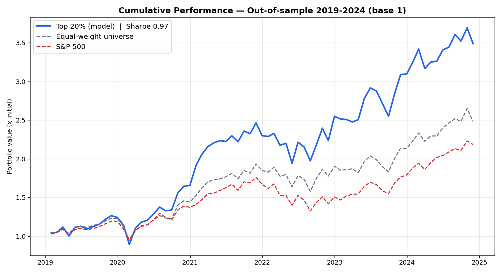
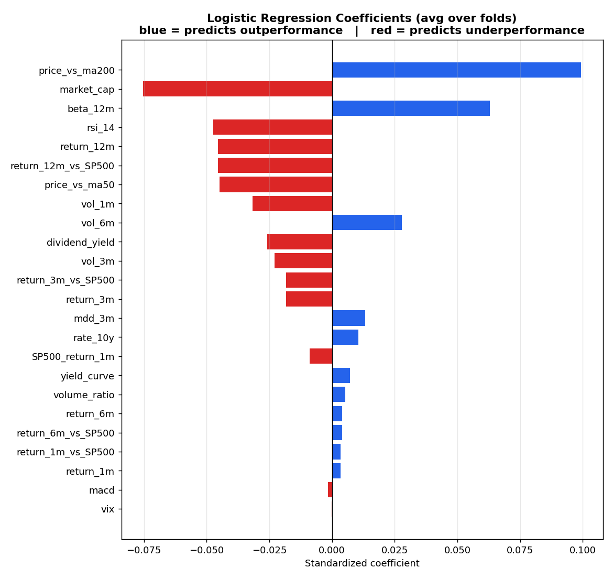

🇬🇧 [English](README.md) · 🇫🇷 **Français**

# Scoring Quantitatif du S&P 500 par Machine Learning

Pipeline de bout en bout pour **sélectionner mensuellement les actions du S&P 500** susceptibles de surperformer le marché, à partir de features financières, puis **backtester** la stratégie qui en découle — avec une méthodologie rigoureuse, sans look-ahead bias.

> **Objectif pédagogique** : démontrer la maîtrise du cycle complet d'une stratégie quantitative — construction de features, validation temporelle, modélisation, et évaluation *honnête* de la performance ajustée du risque.

---

## Résumé des résultats

La stratégie **long-only (top 20 %)** surperforme le S&P 500 en rendement absolu, mais l'analyse rigoureuse montre que **cette surperformance provient essentiellement de l'exposition au marché (beta), et non d'un alpha de sélection statistiquement significatif**.

| Métrique (out-of-sample 2019–2024) | Top 20 % | S&P 500 |
|---|---|---|
| Rendement annualisé (net de coûts) | **26.0 %** | 15.8 % |
| Sharpe ratio (net) | **0.93** | 0.85 |
| Max Drawdown | −29.5 % | ~−24 % |
| Beta (vs S&P 500) | 1.33 | 1.00 |
| Alpha annualisé | +4.8 % | — |
| **t-stat de l'alpha** | **1.12 → non significatif** | — |

**Conclusion assumée** : sur des marchés quasi-efficients, un signal ML faible (AUC ≈ 0.52) génère du rendement, mais pas d'alpha robuste après contrôle du risque de marché. Ce résultat — obtenu sans biais méthodologique — est le cœur de la démarche.



*Performance cumulée out-of-sample (2019–2024). Le portefeuille Top 20% surperforme les deux benchmarks en absolu — mais l'analyse alpha/beta montre que l'essentiel de l'excès provient d'une exposition marché plus élevée (beta 1.33), pas d'un alpha de sélection significatif.*

---

## Ce que ce projet démontre

- **Tout codé from scratch — aucune boîte noire pour la logique cœur :**
  - Les **24 features** (RSI, MACD, beta 12 mois, volatilité, max drawdown, moyennes mobiles…) calculées manuellement à partir des prix bruts — **sans TA-Lib**.
  - La **winsorization** bâtie sur une **fonction quantile codée à la main** (interpolation linéaire).
  - Une **régression logistique régularisée (L2)** implémentée from scratch — sigmoïde, coût log-loss, gradient, descente de gradient vectorisée — **validée** en reproduisant `scikit-learn` à la 4ᵉ décimale (AUC 0.5161 vs 0.516).
- **Rigueur temporelle** : aucune fuite d'information (walk-forward validation, normalisation *cross-section*, standardisation *fit sur train uniquement*).
- **Backtest professionnel** : Sharpe, alpha/beta (CAPM), max drawdown, turnover, coûts de transaction, variante long-short market-neutral.
- **Honnêteté intellectuelle** : distinction beta / alpha, tests de significativité, biais documentés.

---

## Méthodologie

### 1. Données
- **Univers** : composants du S&P 500 (~440 actions valides / mois après nettoyage).
- **Période** : 2014–2024 (données exploitables : **oct. 2015 → déc. 2024**).
- **Fréquence** : mensuelle (rééquilibrage en fin de mois).
- **Sources** : `yfinance` (prix ajustés, volumes, dividendes, nombre d'actions), VIX, taux US.
- **Cible** : classification binaire — l'action surperforme-t-elle la **médiane** du marché le mois suivant ?

### 2. Les 24 features (calculées manuellement)
| Famille | Features |
|---|---|
| Momentum (8) | rendements 1/3/6/12 mois, en absolu et relatif au S&P 500 |
| Risque (5) | volatilités 1/3/6 mois, beta 12 mois, max drawdown 3 mois |
| Technique (5) | RSI 14j, MACD, prix/MM50, prix/MM200, ratio de volume |
| Macro (4) | VIX, courbe des taux, taux 10 ans, rendement mensuel du S&P 500 |
| Fondamentaux (2) | rendement du dividende, capitalisation boursière (log) |

### 3. Preprocessing (anti-look-ahead)
- **Winsorization** des outliers (1ᵉ / 99ᵉ percentile), *cross-section* par date.
- **Log** de la capitalisation boursière (distribution log-normale → facteur *Size*).
- **Normalisation z-score cross-section** par date (cohérente avec la cible cross-sectionnelle, robuste aux régimes de marché).
- Filtrage des mois à faible effectif (< 100 actions) pour une cross-section significative.

### 4. Modélisation — Walk-Forward Validation
Validation temporelle par fenêtre expansive (pas de K-Fold classique, qui fuiterait le futur) :
```
Train 2015→2018 → Test 2019
Train 2015→2019 → Test 2020
...           → ...
Train 2015→2023 → Test 2024
```

| Modèle | AUC moyenne (6 folds) |
|---|---|
| **Régression logistique** (baseline, from scratch) | **0.516** |
| MLP (32, 16) | 0.512 |
| Random Forest | 0.506 |

> Enseignement : sur données à faible ratio signal/bruit, le modèle **linéaire** domine les modèles non-linéaires plus complexes, qui ajoutent surtout de la variance. Le signal cross-sectionnel exploitable est essentiellement **linéaire**.



*Coefficients de la régression logistique moyennés sur les folds. Les signaux les plus forts sont économiquement interprétables : momentum long terme (`price_vs_ma200`, +), facteur **Size** (`market_cap`, − → les small caps surperforment), forte sensibilité au marché (`beta_12m`, +), et mean-reversion court terme (`rsi_14`, −).*

### 5. Backtest
- Portefeuille = **top 20 %** des scores chaque mois, equal-weight.
- Comparaison à **deux** benchmarks : le S&P 500 (cap-weighted) **et** l'univers equal-weight (pour isoler le stock-picking pur du biais equal-weight).
- Variante **long-short** (long top 20 % / short bottom 20 %) : beta résiduel de 0.53, alpha non significatif (t = 0.58).

---

## Résultats détaillés du backtest (out-of-sample 2019–2024)

| Métrique | Long-only (Top 20 %) | Long-Short (top − bottom 20 %) |
|---|---|---|
| Rendement annualisé (brut) | 27.3 % | 11.5 % |
| Rendement annualisé (net de coûts) | **26.0 %** | — |
| Sharpe ratio (brut / net) | 0.97 / **0.93** | 0.70 |
| Max Drawdown | −29.5 % | — |
| Turnover mensuel | 42.7 % | — |
| Coûts de transaction (hypothèse 10 bps/trade) | ~1.0 % / an | — |
| Beta vs S&P 500 | 1.33 | **0.53** |
| Alpha annualisé vs S&P 500 | +4.8 % (t = 1.12) | +3.1 % (t = 0.58) |
| Alpha annualisé vs univers equal-weight | +2.5 % (t = 0.83) | — |

> **Aucun alpha n'est statistiquement significatif** (tous |t| < 2). La performance absolue provient surtout de l'exposition au marché (beta), pas de la sélection de titres — un résultat réaliste et honnêtement rapporté.

---

## Structure du dépôt

```
python-projet-sp500/
├── data/
│   ├── raw/                          # CSV bruts (prix, volumes, dividendes, VIX, taux…)
│   └── processed/
│       └── features_with_label.csv   # dataset final (66 396 × 25) — régénéré par le notebook
├── assets/                           # figures utilisées dans le README
├── collect_data_projet_sp500.ipynb   # collecte des données
├── sp500_ml_project.ipynb            # pipeline principal (features → modèles → backtest)
└── README.md
```

---

## Stack technique

`Python` · `pandas` · `numpy` · `scikit-learn` · `scipy` · `yfinance` · `matplotlib`

---

## Biais et limites (assumés)

| Biais / limite | Statut |
|---|---|
| **Look-ahead bias** | Évité (walk-forward, normalisation cross-section, fit sur train) |
| **Survivorship bias** | Présent — composition actuelle du S&P 500 utilisée |
| **Disponibilité `market_cap`** | Historique fiable depuis oct. 2015 (`get_shares_full`) → dataset tronqué en amont |
| **Coûts de transaction** | Modélisés simplement (10 bps/trade) ; slippage et impact marché non modélisés |
| **Alpha non significatif** | Résultat honnête — pas de surperformance robuste après contrôle du beta |

---

## Pistes d'amélioration

- **Beta-hedge** du long-short pour un vrai portefeuille market-neutral.
- **Neutralisation sectorielle** des scores.
- Features **fondamentales** supplémentaires (qualité, value, croissance).
- Optimisation d'hyperparamètres via validation imbriquée (sans toucher au test).

---

## Reproduction

```bash
pip install pandas numpy scikit-learn scipy yfinance matplotlib
```
1. Exécuter `collect_data_projet_sp500.ipynb` pour télécharger les données (ou utiliser les CSV fournis dans `data/raw/`).
2. Exécuter `sp500_ml_project.ipynb` de haut en bas : features → preprocessing → modèles → backtest.

---

*Projet réalisé dans le cadre d'une préparation à un poste en finance de marché quantitative.*
